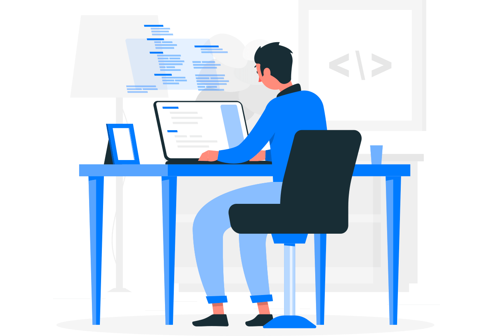

# Porfolio
Html: Crear 4 subelementos en la sección de trabajo con nombre y descripción.

	

		<button name="button_acept" type="button" id="btn_hide" onclick="showDescriptbtn()" description class="btn btn-primary">aceptar</button>
		
Boton para aceptar 

	

	

		
		
Una imagen de referencia

	

	

		<input name="Campo_texto" type="text" class="form-control" aria-label="Username" onclick="showDescriptInput()" aria-describedby="basic-addon1">
		
Campo de texto para poder escribir un comentario

	

	

		<a name="link_gitHub" href="https://github.com/daniFlakk/Porfolio" onclick="showDescriptLink()" target="blank">github proyecto</a>
		
Link que redirige a la pagina de gitHub del proyecto

	

Css: Los elementos creados deben estar distribuidos en 4 columnas. La descripción no debe mostrarse al cargar inicialmente la página.
style="display: none;"

Javascript: Cuando el usuario selecciona uno de los elementos, debe mostrar la descripciòn del elemento seleccionado.
function showDescriptbtn() {
    var x = document.getElementById("descript");
    if (x.style.display === "none") {
        x.style.display = "block";
    } else {
        x.style.display = "none";
    }
}

Git: se debe crear una rama llamada "Parcial_1", tener minimo 3 commits, dejar en el readme file los puntos desarrollados.
Identacion - nombre de variables, clases e ids en ingles. - buenas practicas - distribución de archivos, titulo de la web, broken links(Imágenes y urls).